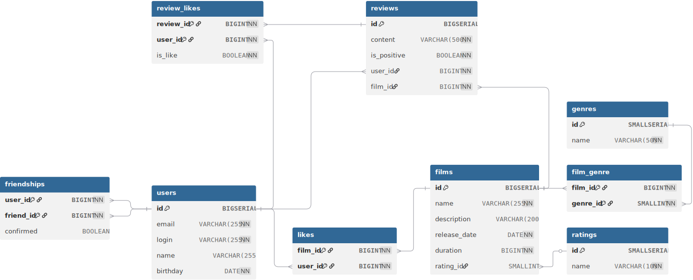

# java-filmorate
## Схема базы данных

## Пояснение к схеме базы данных
### Основные сущности:
- `films` — фильмы: название, описание, дата выпуска, продолжительность.
- `ratings` — справочник рейтингов MPAA (G, PG, PG-13, R, NC-17).
- `genres` — справочник жанров фильмов.
- `film_genre` — связь фильмов с жанрами (многие ко многим).
- `users` — пользователи: email, логин, имя, дата рождения.
- `likes` — лайки пользователей на фильмы (пара `film_id`, `user_id` — первичный ключ).
- `friendships` — дружба между пользователями: направленная связь с флагом `confirmed` (подтверждение).

### Ключевые ограничения и индексы:
- Внешние ключи с каскадным удалением (`ON DELETE CASCADE`) для `film_genre`, `likes`, `friendships`, `reviews`, `review_likes`.
- При удалении рейтинга значение в `films.rating_id` становится `NULL` (`ON DELETE SET NULL`).
- Проверки `CHECK` на корректность дат и длительности фильма.
- Индексы на `friendships(user_id)` и f`riendships(friend_id)` для быстрого поиска друзей.
- Уникальность `email` и `login` пользователей.

### Примеры запросов для основных операций

#### Топ N наиболее популярных фильмов (по количеству лайков):
```sql
SELECT f.* 
FROM films f 
LEFT JOIN likes l ON f.id = l.film_id 
GROUP BY f.id 
ORDER BY COUNT(l.user_id) 
DESC LIMIT ?
```

#### Найти фильм по `film_id`:
```sql
SELECT g.id, g.name 
FROM genres g
     JOIN film_genre fg ON g.id = fg.genre_id
WHERE fg.film_id = 1 -- film_id = 1  
ORDER BY g.id
```

#### Вставка нового пользователя:
```sql
INSERT INTO users(email, login, name, birthday)
VALUES ('user@example', 'user', 'Ivan', '1996-08-07')
```
